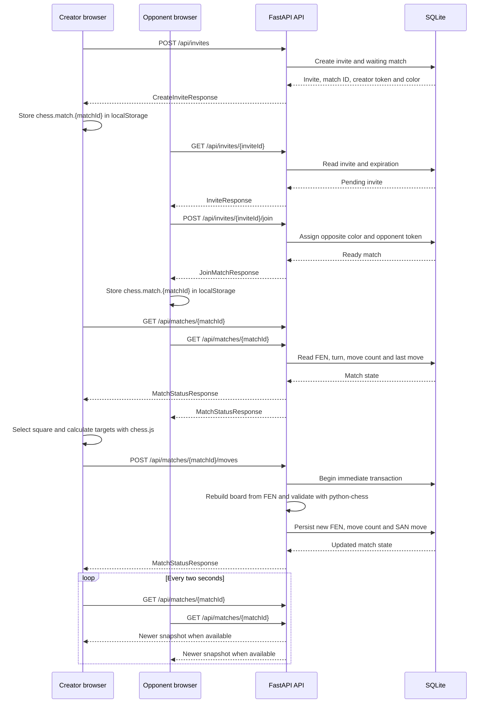

# Architecture and Data Flow

This document describes the current implementation of Chess With Friends. The application uses a React frontend, a FastAPI backend, and SQLite persistence. Match updates currently use HTTP polling; WebSockets are not part of the implementation.

## System overview

The frontend owns presentation and interaction state. The backend owns player identity within a match, chess-rule validation, and persisted match state.

The frontend uses `chess.js` to render a FEN position and highlight legal destinations. This is interaction assistance only. The backend reconstructs the board from FEN and uses `python-chess` as the final authority before accepting a move.

## Frontend responsibilities

### `App.tsx`

`App.tsx` defines the top-level routes and shared header/footer:

- `/` renders the home page.
- `/create-match` renders match creation settings.
- `/invite/:inviteId` loads and joins an invite.
- `/match/:matchId` renders the active match.

### `CreateMatchPage`

The create-match page:

- collects the requested color and time-control values;
- calls `POST /api/invites`;
- stores the creator's match session in `localStorage`;
- navigates the creator to the match page.

The selected time control is persisted as match configuration, but clocks are not currently implemented.

### `InvitePage`

The invite page:

- checks whether the browser already has the creator's session for the invite;
- loads the public invite details;
- prevents the creator from joining their own invite through the existing token check;
- calls the join endpoint anonymously for an opponent;
- stores the opponent's returned session in `localStorage`;
- navigates the opponent to the match page.

### `MatchPage`

The match page:

- loads the match using the stored player token;
- polls `GET /api/matches/{matchId}` every two seconds;
- keeps the current FEN, selected square, legal targets, and submission state locally;
- submits moves through the REST API;
- applies a server response only after the move succeeds;
- ignores a poll response whose `moveCount` is older than the latest applied state.

If an initial load fails, the page shows an unavailable-match state. If a later poll fails after a match has loaded, the current UI retains the loaded board while recording the load error state.

### `ChessBoard`

The board component:

- renders squares from a FEN string;
- exposes accessible labels containing the square and piece, such as `e2, White pawn`;
- marks the selected square;
- marks legal target squares;
- sends square clicks back to `MatchPage`.

### `chess/board.ts`

The frontend chess helpers:

- convert FEN into renderable board squares and Unicode piece symbols;
- calculate legal target squares with `chess.js`;
- detect pawn moves reaching the back rank;
- default those promotion requests to a queen.

## Backend responsibilities

### `app/main.py`

`main.py` creates the FastAPI application and defines the HTTP routes. It checks player-token headers, looks up the relevant database state, and converts expected domain errors into HTTP responses.

### `app/models.py`

`models.py` defines the Pydantic request and response contracts. It also defines the supported color, time-control, and promotion values. Python field names use aliases where the JSON API uses camelCase, including `timeControl`, `matchId`, `creatorToken`, `playerToken`, `moveCount`, and `lastMove`.

### `app/database.py`

`database.py` owns:

- SQLite table initialization and additive compatibility updates;
- invite creation, lookup, and expiration;
- random token generation and player-color assignment;
- match lookup by player token;
- server-side move validation with `python-chess`;
- FEN, move count, and move-history persistence;
- reconstruction of the match status response.

## Invite-to-move data flow



The backend remains authoritative for turns, legal moves, promotion, castling, en passant, and rejection of moves after game over. A successful move returns the complete current snapshot, including the new FEN and `moveCount`.

## Local match sessions

Each browser stores a match session under:

```text
chess.match.{matchId}
```

The JSON value has this shape:

```json
{
  "inviteId": "invite-id",
  "playerToken": "player-token",
  "color": "white"
}
```

The token is returned by the backend when a match is created or joined. The frontend sends it in the `X-Player-Token` header for authenticated match requests. The session is browser-local and anonymous; it is not an account or login system. Clearing or corrupting `localStorage` prevents that browser from reopening the match session.

## Polling and stale responses

`MatchPage` performs an immediate status request and then repeats the request every two seconds. Each response includes `moveCount`, which acts as the current synchronization version.

The page stores the latest applied count in a ref. A response with a lower count is ignored, so an older request cannot overwrite a newer board position if requests complete out of order.
