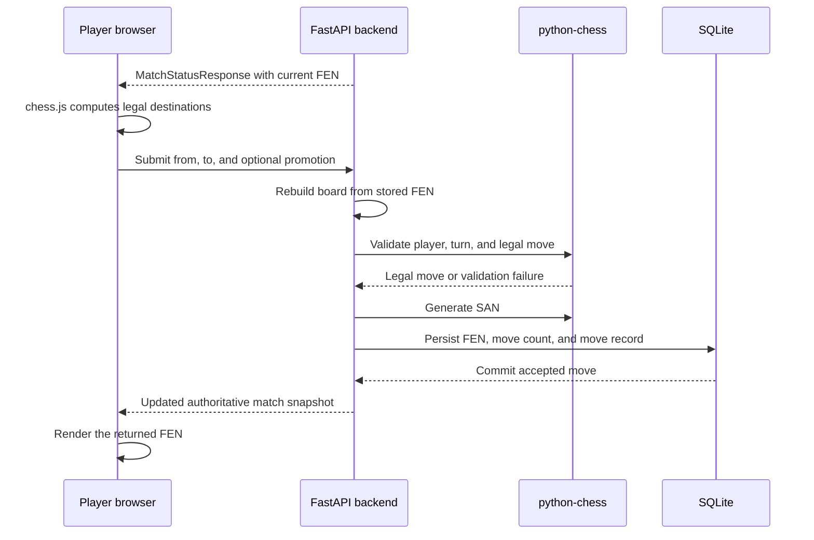

# Chess Domain Guide

This guide explains how a move travels through Chess With Friends and introduces the chess notation and state concepts used by the application.

## Move lifecycle

The lifecycle is:

1. The frontend receives the current board position as server-provided FEN.
2. `chess.js` parses that FEN and computes legal destinations for interaction feedback.
3. The player selects a source and destination square.
4. The frontend submits the source square, destination square, and optional promotion value.
5. The backend reconstructs the board from the stored FEN.
6. `python-chess` validates the player, turn, move legality, and game-over state.
7. The backend generates SAN, persists the new FEN and move count, records the move, and returns the updated snapshot.
8. The frontend updates the board only after the server response succeeds.

## Server authority versus UI feedback

The frontend uses `chess.js` to highlight legal destinations before a move is submitted. This makes the board easier to use, but it is not a security or correctness boundary.

The backend is authoritative. It checks the player token, match readiness, current turn, legal move, promotion value, and game-over state using the persisted FEN and `python-chess`. A client cannot make an illegal move valid by bypassing the frontend.

## Board state and notation

### FEN

Forsyth–Edwards Notation (FEN) is the complete snapshot of a chess position. In this project it is stored in the `matches.fen` column and returned in every match status response.

The FEN includes the piece placement, side to move, castling rights, en-passant target, halfmove clock, and fullmove number. Rebuilding a `python-chess` board from FEN lets the backend validate the next move without replaying the entire move history.

### SAN

Standard Algebraic Notation (SAN) is human-readable notation for an accepted move. The backend generates SAN before pushing the move and stores it in `match_moves.san`.

Examples include:

- `e4` for a pawn move;
- `exd6` for a pawn capture, including the tested en-passant case;
- `O-O` for kingside castling;
- `e8=Q+` for promotion to a queen with check.

### `moveCount`

`moveCount` is the number of accepted moves in a match. The frontend uses it as a synchronization version while polling:

- a successful move increments it;
- a poll response with a lower count is ignored;
- this prevents an older response from overwriting a newer board position when requests complete out of order.

## Supported special moves

The backend validates the following special cases through `python-chess`:

- castling;
- en passant;
- promotion to queen, rook, bishop, or knight;
- check notation in SAN;
- rejection of moves after the board is already game over.

The frontend's current promotion helper defaults a pawn reaching the back rank to a queen. There is no dedicated promotion-selection UI yet, although the backend accepts all four supported promotion pieces when they are submitted through the API.

## Current presentation boundaries

- The API returns `lastMove`, but the database stores the complete accepted move history.
- The frontend does not currently expose a complete move-history review interface.
- The API exposes persisted `gameStatus`, `winner`, and `drawReason` fields for check, checkmate, stalemate, and automatic draws.
- Threefold repetition and the fifty-move rule remain claimable conditions and are not automatic terminal results.
