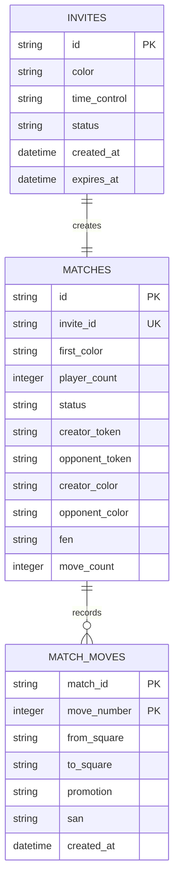

# SQLite Data Model

SQLite is the persistence source of truth for invites, matches, and accepted moves.

## Database location

The default database path is:

```text
backend/data/chess.db
```

`InviteDatabase` creates the parent directory when needed. Backend tests pass temporary database paths so test data does not use the default database.

## Relationships

Each invite has one associated match. A match can have one creator and at most one opponent. Accepted moves belong to a match and are ordered by their move number.



The database currently relies on application-level relationships rather than declared SQLite foreign-key constraints.

## `invites`

| Column | Meaning |
| --- | --- |
| `id` | Public invite identifier. |
| `color` | Requested creator color: `white`, `black`, or `random`. |
| `time_control` | Stored selection: `unlimited`, `10-minutes`, or `5-minutes`. |
| `status` | Currently `pending` or `expired`. |
| `created_at` | Invite creation timestamp. |
| `expires_at` | Timestamp after which the invite cannot be fetched or joined. |

Invite expiration is checked when an invite is fetched or joined. Expiration is not a background job; the relevant request marks an expired invite.

Creating an invite also creates its waiting match in the same database operation.

## `matches`

| Column | Meaning |
| --- | --- |
| `id` | Match identifier returned to the frontend. |
| `invite_id` | The invite associated with this match; unique in the current schema. |
| `first_color` | Color assigned to the creator when the match is created. |
| `player_count` | Number of players currently assigned, initially `1` and then `2`. |
| `status` | Currently `waiting` or `ready`. |
| `creator_token` | Anonymous token issued to the creator. |
| `opponent_token` | Anonymous token issued when the invite is joined. |
| `creator_color` | Resolved color of the creator. |
| `opponent_color` | Resolved color of the opponent. |
| `fen` | Complete current board state. |
| `move_count` | Number of accepted moves. |

The creator starts with one player and a resolved color. When an opponent joins, the opponent receives the opposite color, `player_count` becomes two, and `status` becomes `ready`.

Moves are accepted only for a ready match. Each accepted move replaces `fen` with the new board position and increments `move_count`.

## `match_moves`

| Column | Meaning |
| --- | --- |
| `match_id` | Match to which the move belongs. |
| `move_number` | One-based accepted move number within the match. |
| `from_square` | Source square, such as `e2`. |
| `to_square` | Destination square, such as `e4`. |
| `promotion` | Promotion piece (`q`, `r`, `b`, or `n`), or null. |
| `san` | Standard Algebraic Notation generated by `python-chess`. |
| `created_at` | Move creation timestamp. |

The primary key is `(match_id, move_number)`, so each move number can occur only once for a match. The table preserves the complete accepted move history, although the current match-status API exposes only `lastMove` rather than the full history.

Examples of SAN stored in this table include `e4`, `exd6`, `O-O`, and `e8=Q+`.

## Initialization and compatibility

`InviteDatabase._initialize()` runs when the application is created:

- missing `invites`, `matches`, and `match_moves` tables are created;
- missing columns on an existing `matches` table are added with `ALTER TABLE`;
- existing matches with no `fen` receive the starting position;
- existing matches with no `move_count` receive zero.

This is a lightweight additive backfill approach. It is not a versioned migration framework: the project does not currently provide migration identifiers, rollback migrations, or a separate migration CLI.

The compatibility logic allows older match rows created before board-state persistence was added to be read with a starting FEN and zero moves.
